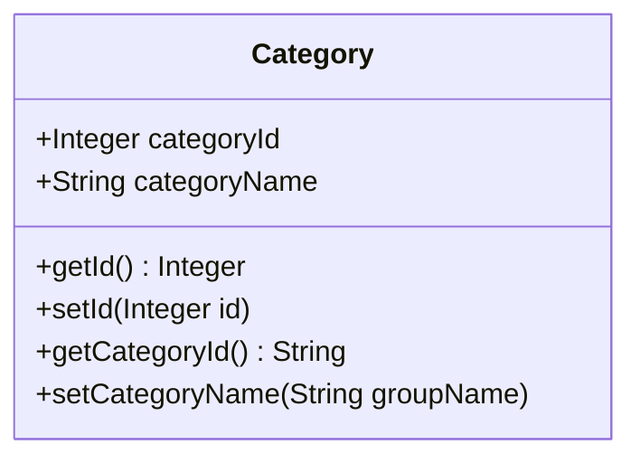

### CategoryEntity:

```mermaid
classDiagram
class Category {
    +Integer categoryId
    +String categoryName
    +getId() Integer
    +setId(Integer id)
    +getCategoryId() String
    +setCategoryName(String groupName)
}
```

