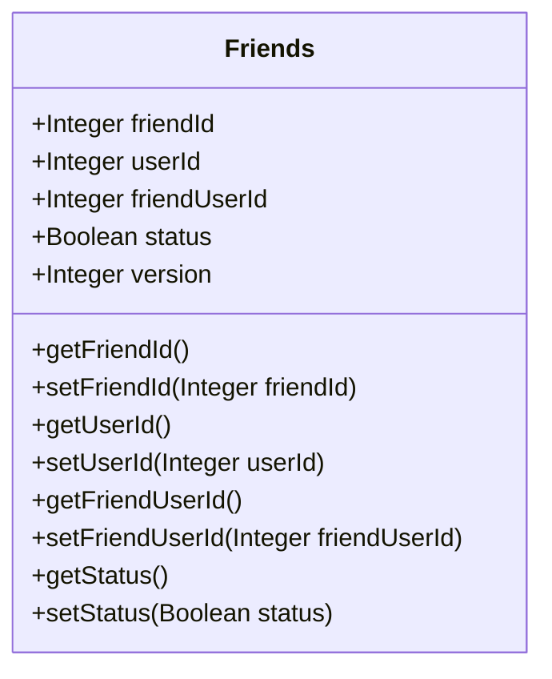
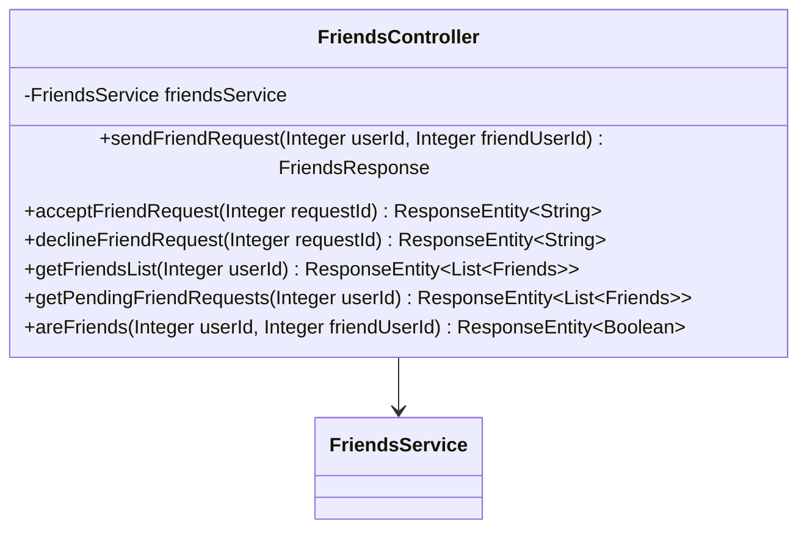
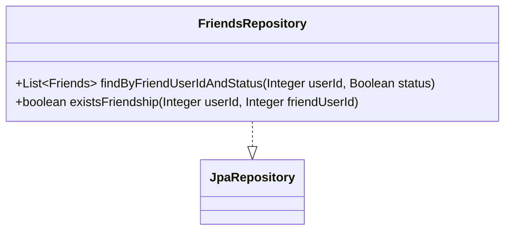
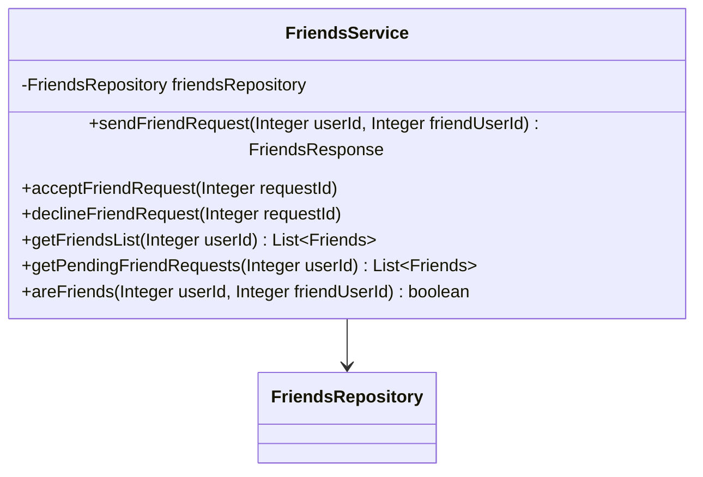

### FriendsEntity

```mermaid
classDiagram
class Friends {
    +Integer friendId
    +Integer userId
    +Integer friendUserId
    +Boolean status
    +Integer version
    +getFriendId()
    +setFriendId(Integer friendId)
    +getUserId()
    +setUserId(Integer userId)
    +getFriendUserId()
    +setFriendUserId(Integer friendUserId)
    +getStatus()
    +setStatus(Boolean status)
}
```

### Friends Controller

```mermaid
classDiagram
class FriendsController {
    -FriendsService friendsService
    +sendFriendRequest(Integer userId, Integer friendUserId) FriendsResponse
    +acceptFriendRequest(Integer requestId) ResponseEntity~String~
    +declineFriendRequest(Integer requestId) ResponseEntity~String~
    +getFriendsList(Integer userId) ResponseEntity~List~Friends~~
    +getPendingFriendRequests(Integer userId) ResponseEntity~List~Friends~~
    +areFriends(Integer userId, Integer friendUserId) ResponseEntity~Boolean~
}
FriendsController --> FriendsService
```

### FriendsRepository

```mermaid
classDiagram
class FriendsRepository {
    +List~Friends~ findByFriendUserIdAndStatus(Integer userId, Boolean status)
    +boolean existsFriendship(Integer userId, Integer friendUserId)
}
FriendsRepository ..|> JpaRepository
```

### FriendsService

```mermaid
classDiagram
class FriendsService {
    -FriendsRepository friendsRepository
    +sendFriendRequest(Integer userId, Integer friendUserId) FriendsResponse
    +acceptFriendRequest(Integer requestId)
    +declineFriendRequest(Integer requestId)
    +getFriendsList(Integer userId) List~Friends~
    +getPendingFriendRequests(Integer userId) List~Friends~
    +areFriends(Integer userId, Integer friendUserId) boolean
}
FriendsService --> FriendsRepository
```