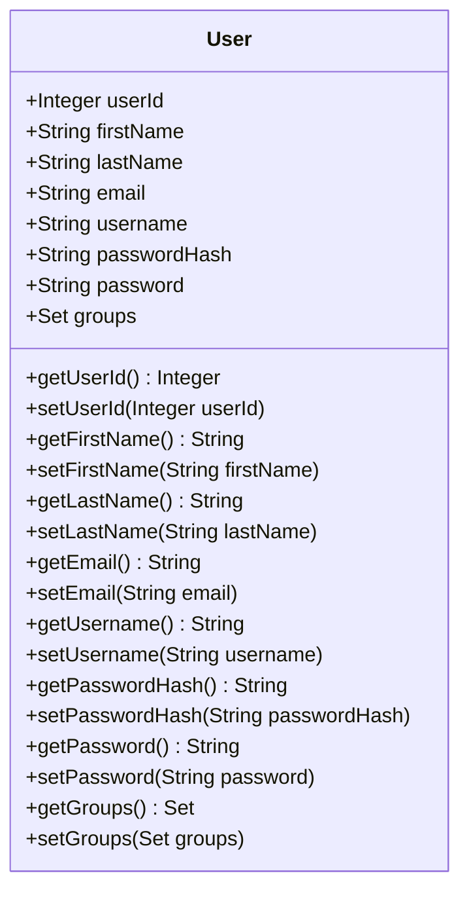
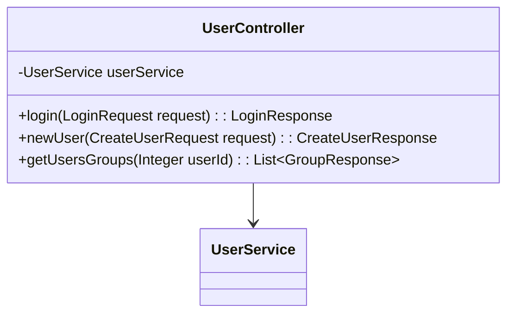
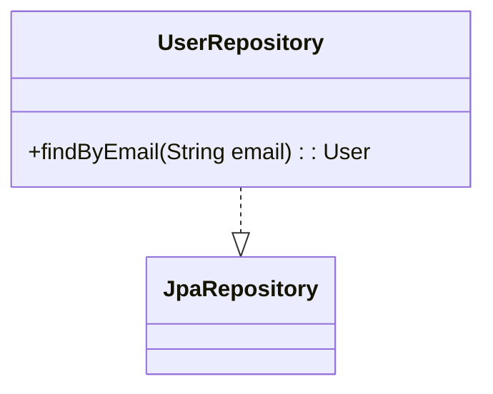
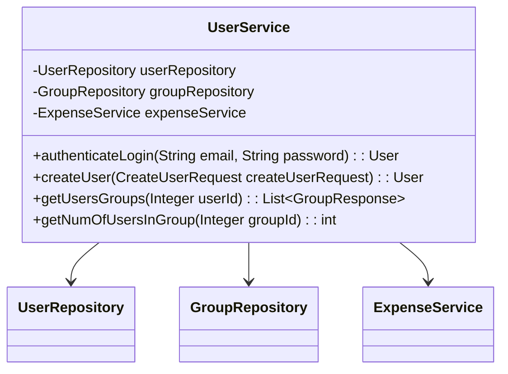

### UserEntity:

```mermaid
classDiagram
class User {
    +Integer userId
    +String firstName
    +String lastName
    +String email
    +String username
    +String passwordHash
    +String password
    +Set<Group> groups
    +getUserId() Integer
    +setUserId(Integer userId)
    +getFirstName() String
    +setFirstName(String firstName)
    +getLastName() String
    +setLastName(String lastName)
    +getEmail() String
    +setEmail(String email)
    +getUsername() String
    +setUsername(String username)
    +getPasswordHash() String
    +setPasswordHash(String passwordHash)
    +getPassword() String
    +setPassword(String password)
    +getGroups() Set<Group>
    +setGroups(Set<Group> groups)
}
```

### UserController:

```mermaid
classDiagram
class UserController {
    -UserService userService
    +login(LoginRequest request) : LoginResponse
    +newUser(CreateUserRequest request) : CreateUserResponse
    +getUsersGroups(Integer userId) : List~GroupResponse~
}
UserController --> UserService
```

### UserRepository:

```mermaid
classDiagram
class UserRepository {
    +findByEmail(String email) : User
}
UserRepository ..|> JpaRepository
```

### UserService:

```mermaid
classDiagram
class UserService {
    -UserRepository userRepository
    -GroupRepository groupRepository
    -ExpenseService expenseService
    +authenticateLogin(String email, String password) : User
    +createUser(CreateUserRequest createUserRequest) : User
    +getUsersGroups(Integer userId) : List~GroupResponse~
    +getNumOfUsersInGroup(Integer groupId) : int
}
UserService --> UserRepository
UserService --> GroupRepository
UserService --> ExpenseService
```

