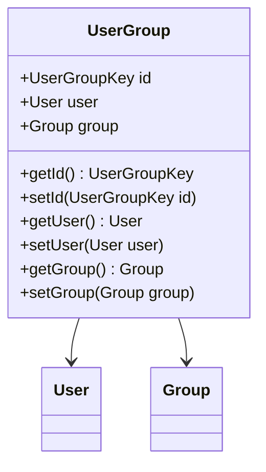
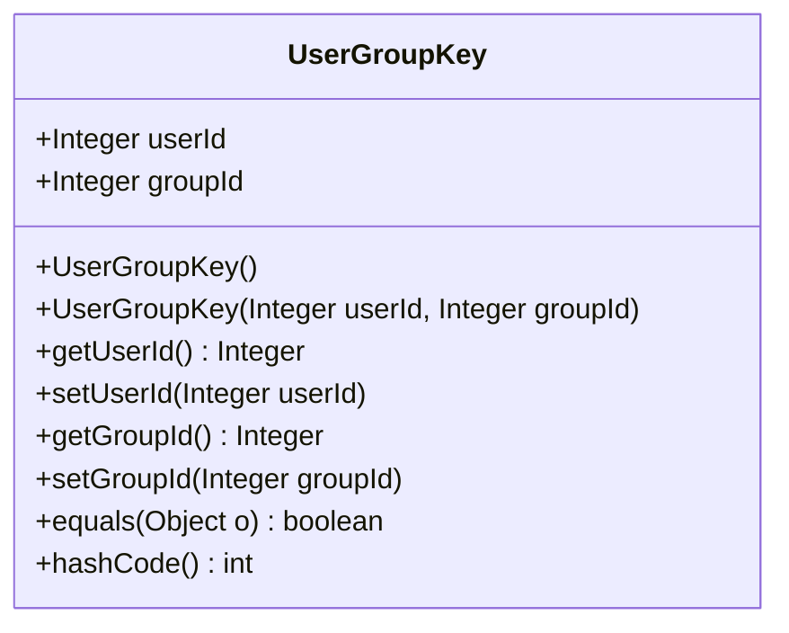

### UserGroupEntity:

```mermaid
classDiagram
class UserGroup {
    +UserGroupKey id
    +User user
    +Group group
    +getId() UserGroupKey
    +setId(UserGroupKey id)
    +getUser() User
    +setUser(User user)
    +getGroup() Group
    +setGroup(Group group)
}
UserGroup --> User
UserGroup --> Group
```

### UserGroupKeyEntity:

```mermaid
classDiagram
class UserGroupKey {
    +Integer userId
    +Integer groupId
    +UserGroupKey()
    +UserGroupKey(Integer userId, Integer groupId)
    +getUserId() Integer
    +setUserId(Integer userId)
    +getGroupId() Integer
    +setGroupId(Integer groupId)
    +equals(Object o) boolean
    +hashCode() int
}
```

