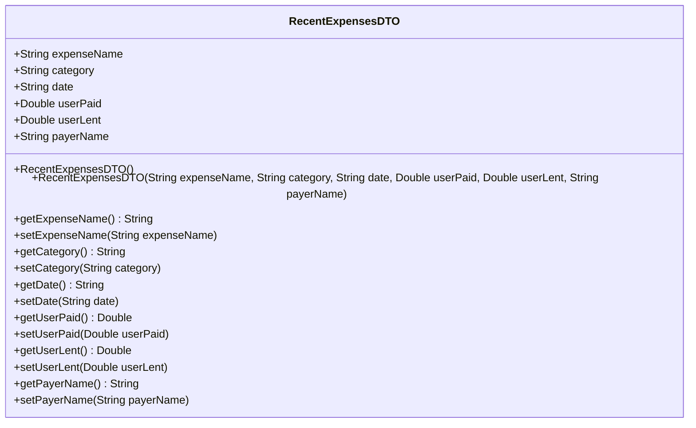
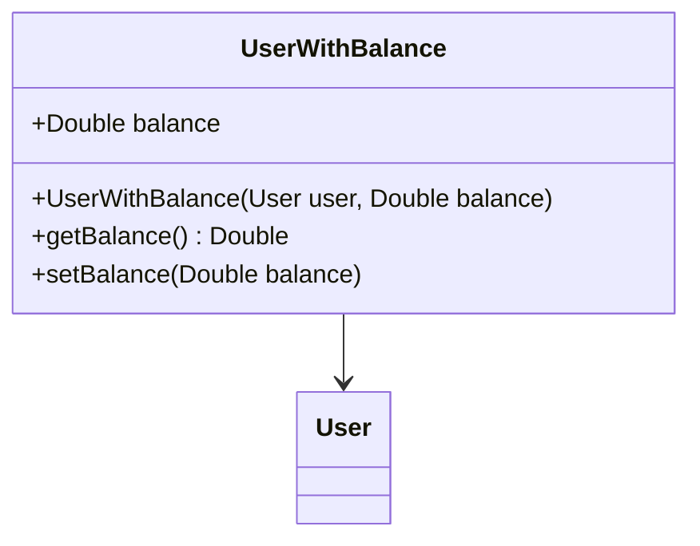

### RecentExpensesDTO:

```mermaid
classDiagram
class RecentExpensesDTO {
    +String expenseName
    +String category
    +String date
    +Double userPaid
    +Double userLent
    +String payerName
    +RecentExpensesDTO()
    +RecentExpensesDTO(String expenseName, String category, String date, Double userPaid, Double userLent, String payerName)
    +getExpenseName() String
    +setExpenseName(String expenseName)
    +getCategory() String
    +setCategory(String category)
    +getDate() String
    +setDate(String date)
    +getUserPaid() Double
    +setUserPaid(Double userPaid)
    +getUserLent() Double
    +setUserLent(Double userLent)
    +getPayerName() String
    +setPayerName(String payerName)
}
```

### UserWithBalance:

```mermaid
classDiagram
class UserWithBalance {
    +Double balance
    +UserWithBalance(User user, Double balance)
    +getBalance() Double
    +setBalance(Double balance)
}
UserWithBalance --> User
```

