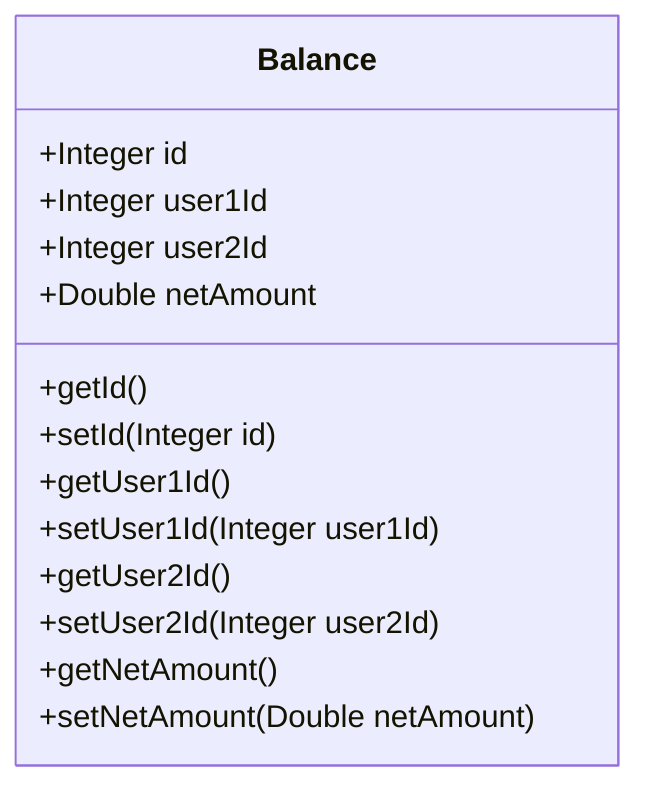
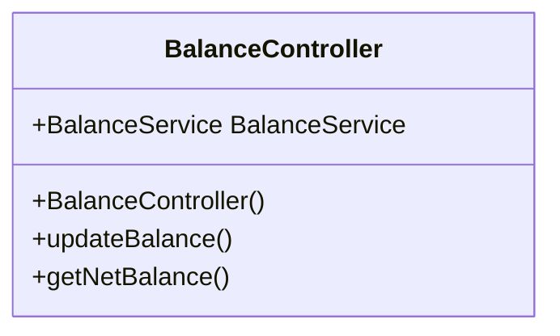
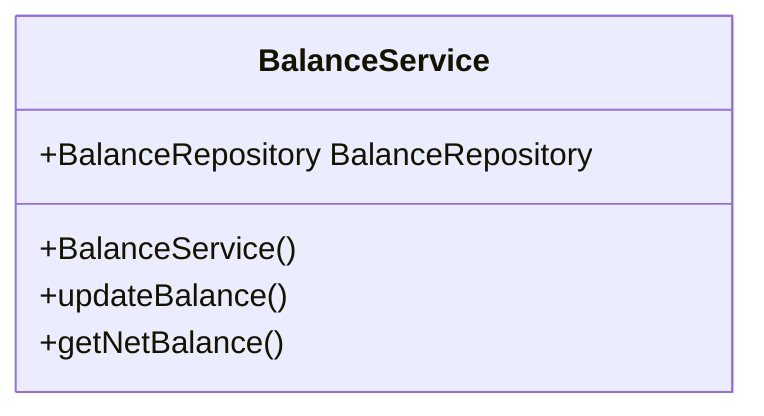
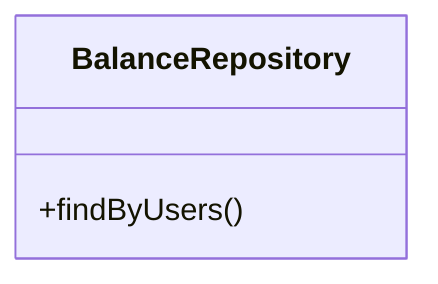

### BalanceEntity:

```mermaid
classDiagram
Balance: +Integer id
Balance: +Integer user1Id
Balance: +Integer user2Id
Balance: +Double netAmount
Balance: +getId()
Balance: +setId(Integer id)
Balance: +getUser1Id()
Balance: +setUser1Id(Integer user1Id)
Balance: +getUser2Id()
Balance: +setUser2Id(Integer user2Id)
Balance: +getNetAmount()
Balance: +setNetAmount(Double netAmount)
```

### BalanceController:

```mermaid
    classDiagram
    BalanceController: +BalanceService BalanceService
    BalanceController: +BalanceController()
    BalanceController: +updateBalance()
    BalanceController: +getNetBalance()
```

### BalanceService:

```mermaid
    classDiagram
    BalanceService: +BalanceRepository BalanceRepository
    BalanceService: +BalanceService()
    BalanceService: +updateBalance()
    BalanceService: +getNetBalance()
```

### BalanceRepository:

```mermaid
    classDiagram
    BalanceRepository: +findByUsers()
```

