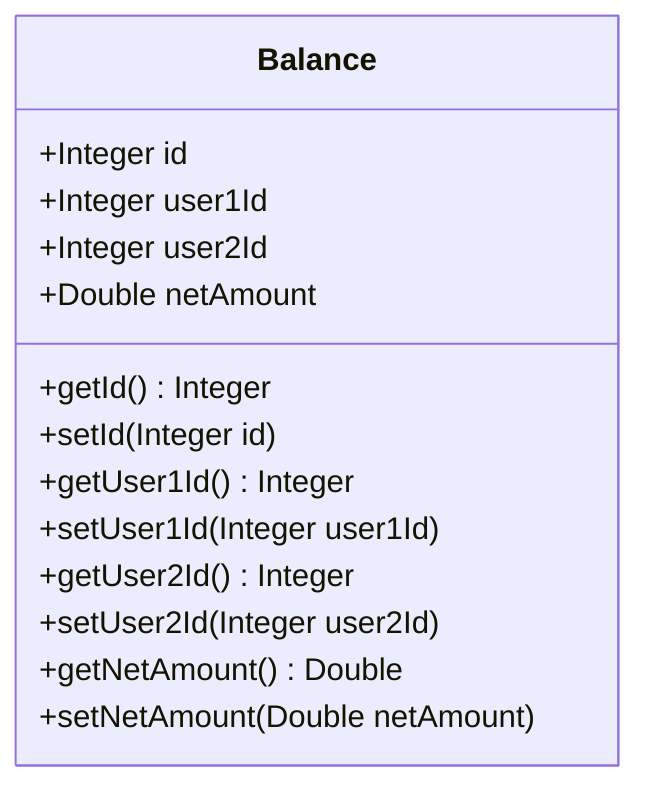
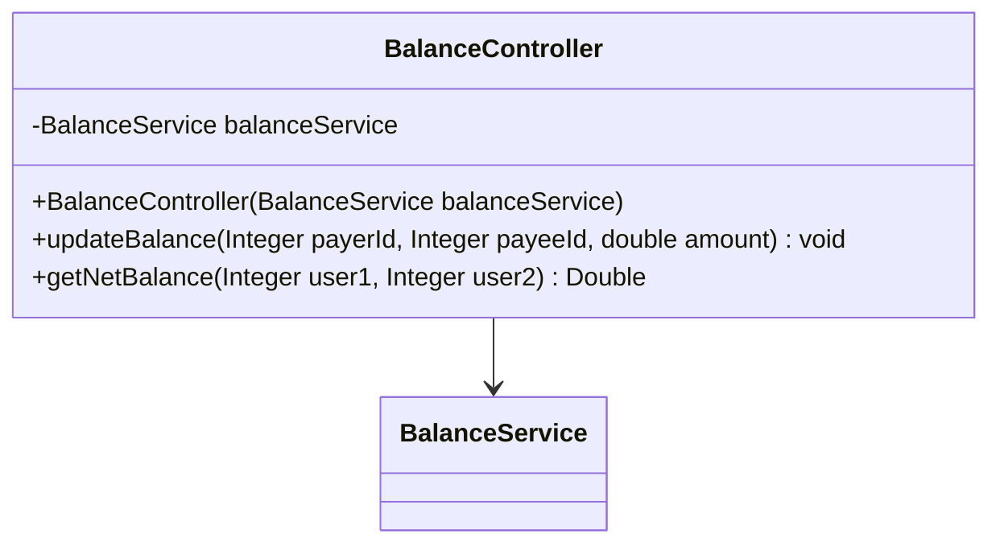
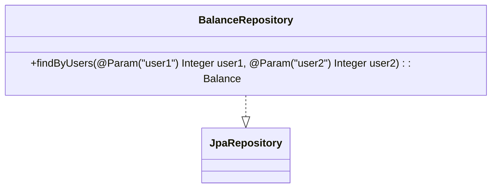
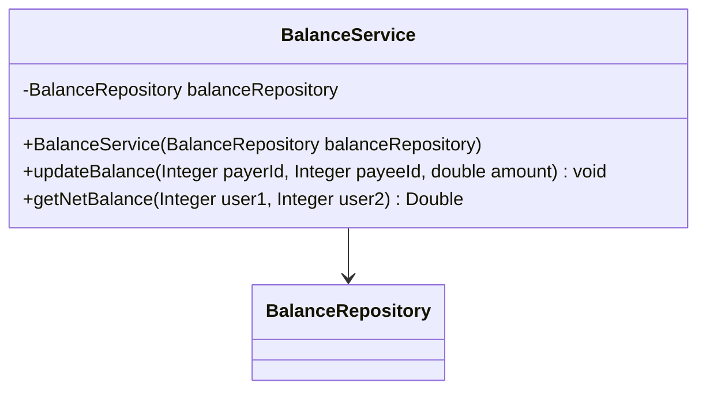

### BalanceEntity:

```mermaid
classDiagram
class Balance {
    +Integer id
    +Integer user1Id
    +Integer user2Id
    +Double netAmount
    +getId() Integer
    +setId(Integer id)
    +getUser1Id() Integer
    +setUser1Id(Integer user1Id)
    +getUser2Id() Integer
    +setUser2Id(Integer user2Id)
    +getNetAmount() Double
    +setNetAmount(Double netAmount)
}
```

### BalanceController:

```mermaid
classDiagram
class BalanceController {
    -BalanceService balanceService
    +BalanceController(BalanceService balanceService)
    +updateBalance(Integer payerId, Integer payeeId, double amount) void
    +getNetBalance(Integer user1, Integer user2) Double
}
BalanceController --> BalanceService
```

### BalanceRepository:

```mermaid
classDiagram
class BalanceRepository {
    +findByUsers(@Param("user1") Integer user1, @Param("user2") Integer user2) : Balance
}
BalanceRepository ..|> JpaRepository
```

### BalanceService:

```mermaid
classDiagram
class BalanceService {
    -BalanceRepository balanceRepository
    +BalanceService(BalanceRepository balanceRepository)
    +updateBalance(Integer payerId, Integer payeeId, double amount) void
    +getNetBalance(Integer user1, Integer user2) Double
}
BalanceService --> BalanceRepository
```

