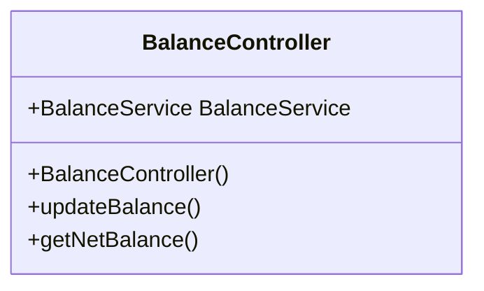
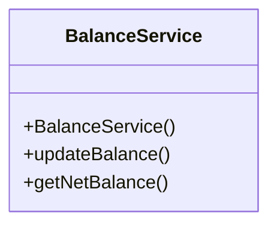

```mermaid
    classDiagram
    BalanceController: +BalanceService BalanceService
    BalanceController: +BalanceController()
    BalanceController: +updateBalance()
    BalanceController: +getNetBalance()
```

### BalanceService[]: # Path: class_diagrams/class.md

```mermaid
    classDiagram
    BalanceService: +BalanceService()
    BalanceService: +updateBalance()
    BalanceService: +getNetBalance()
```