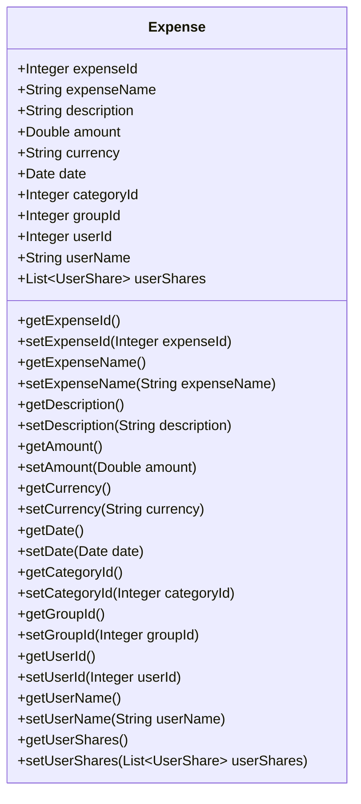

```mermaid
classDiagram
class Expense {
    +Integer expenseId
    +String expenseName
    +String description
    +Double amount
    +String currency
    +Date date
    +Integer categoryId
    +Integer groupId
    +Integer userId
    +String userName
    +List~UserShare~ userShares
    +getExpenseId()
    +setExpenseId(Integer expenseId)
    +getExpenseName()
    +setExpenseName(String expenseName)
    +getDescription()
    +setDescription(String description)
    +getAmount()
    +setAmount(Double amount)
    +getCurrency()
    +setCurrency(String currency)
    +getDate()
    +setDate(Date date)
    +getCategoryId()
    +setCategoryId(Integer categoryId)
    +getGroupId()
    +setGroupId(Integer groupId)
    +getUserId()
    +setUserId(Integer userId)
    +getUserName()
    +setUserName(String userName)
    +getUserShares()
    +setUserShares(List~UserShare~ userShares)
}
```