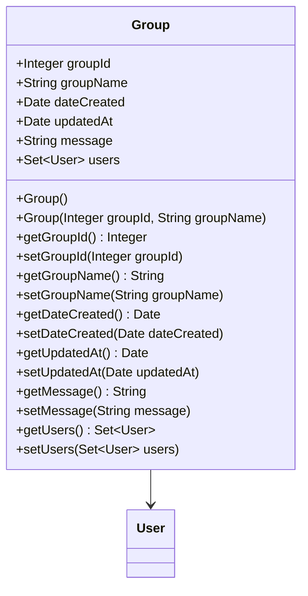
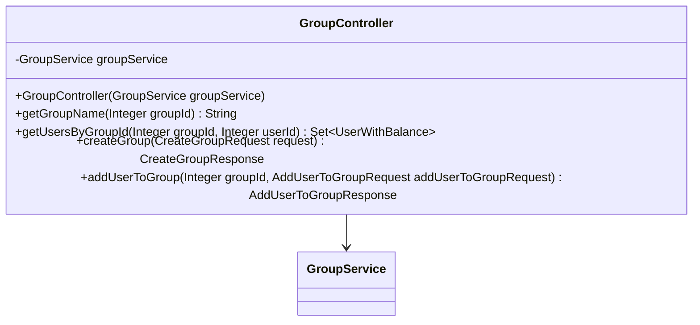
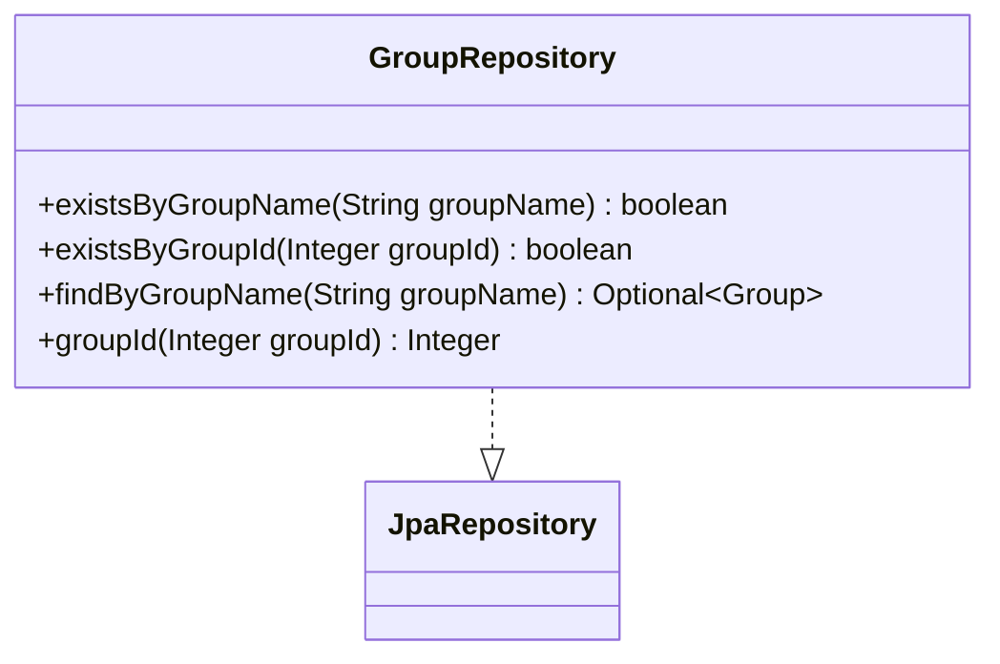
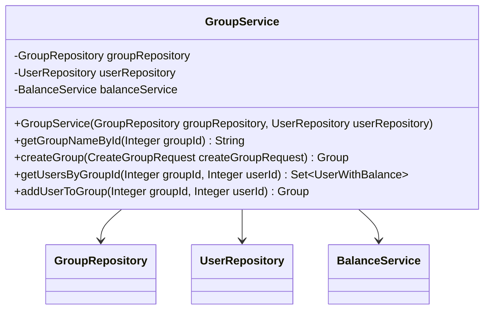

### GroupEntity:

```mermaid
classDiagram
class Group {
    +Integer groupId
    +String groupName
    +Date dateCreated
    +Date updatedAt
    +String message
    +Set~User~ users
    +Group()
    +Group(Integer groupId, String groupName)
    +getGroupId() Integer
    +setGroupId(Integer groupId)
    +getGroupName() String
    +setGroupName(String groupName)
    +getDateCreated() Date
    +setDateCreated(Date dateCreated)
    +getUpdatedAt() Date
    +setUpdatedAt(Date updatedAt)
    +getMessage() String
    +setMessage(String message)
    +getUsers() Set~User~
    +setUsers(Set~User~ users)
}
Group --> User
```

### GroupController:

```mermaid
classDiagram
class GroupController {
    -GroupService groupService
    +GroupController(GroupService groupService)
    +getGroupName(Integer groupId) String
    +getUsersByGroupId(Integer groupId, Integer userId) Set~UserWithBalance~
    +createGroup(CreateGroupRequest request) CreateGroupResponse
    +addUserToGroup(Integer groupId, AddUserToGroupRequest addUserToGroupRequest) AddUserToGroupResponse
}
GroupController --> GroupService
```

### GroupRepository:

```mermaid
classDiagram
class GroupRepository {
    +existsByGroupName(String groupName) boolean
    +existsByGroupId(Integer groupId) boolean
    +findByGroupName(String groupName) Optional~Group~
    +groupId(Integer groupId) Integer
}
GroupRepository ..|> JpaRepository
```

### GroupService:

```mermaid
classDiagram
class GroupService {
    -GroupRepository groupRepository
    -UserRepository userRepository
    -BalanceService balanceService
    +GroupService(GroupRepository groupRepository, UserRepository userRepository)
    +getGroupNameById(Integer groupId) String
    +createGroup(CreateGroupRequest createGroupRequest) Group
    +getUsersByGroupId(Integer groupId, Integer userId) Set~UserWithBalance~
    +addUserToGroup(Integer groupId, Integer userId) Group
}
GroupService --> GroupRepository
GroupService --> UserRepository
GroupService --> BalanceService
```

