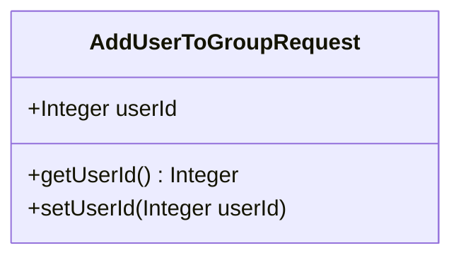
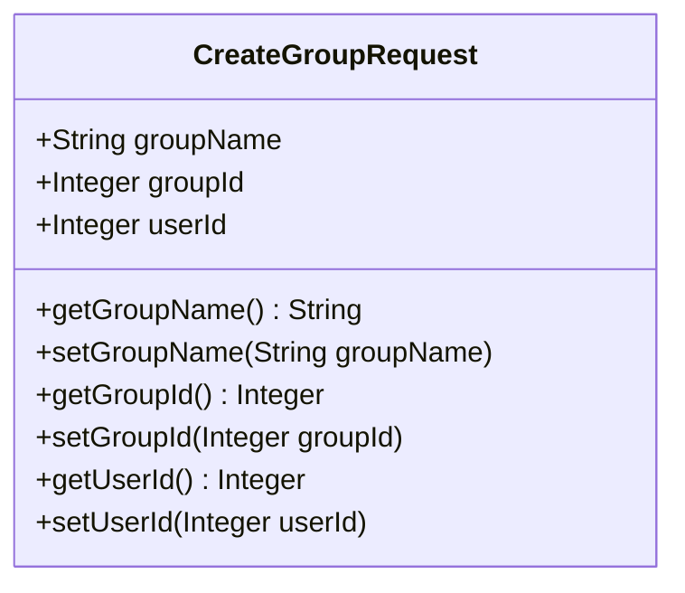
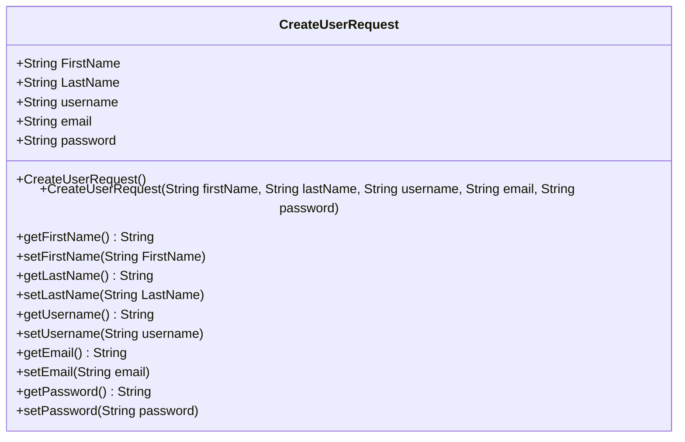
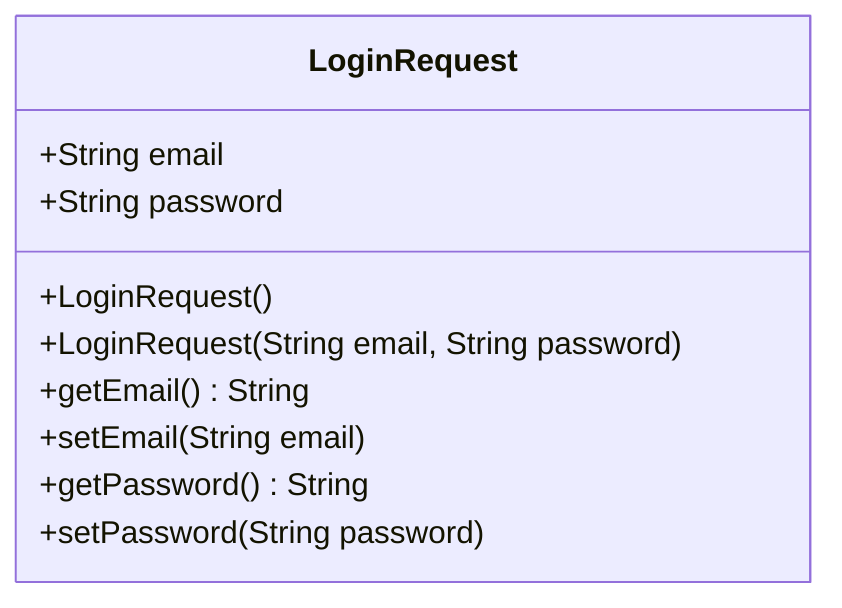

### AddUserToGroupRequest:

```mermaid
classDiagram
class AddUserToGroupRequest {
    +Integer userId
    +getUserId() Integer
    +setUserId(Integer userId)
}
```

### CreateGroupRequest:

```mermaid
classDiagram
class CreateGroupRequest {
    +String groupName
    +Integer groupId
    +Integer userId
    +getGroupName() String
    +setGroupName(String groupName)
    +getGroupId() Integer
    +setGroupId(Integer groupId)
    +getUserId() Integer
    +setUserId(Integer userId)
}
```

### CreateUserRequest:

```mermaid
classDiagram
class CreateUserRequest {
    +String FirstName
    +String LastName
    +String username
    +String email
    +String password
    +CreateUserRequest()
    +CreateUserRequest(String firstName, String lastName, String username, String email, String password)
    +getFirstName() String
    +setFirstName(String FirstName)
    +getLastName() String
    +setLastName(String LastName)
    +getUsername() String
    +setUsername(String username)
    +getEmail() String
    +setEmail(String email)
    +getPassword() String
    +setPassword(String password)
}
```

### LoginRequest: 

```mermaid
classDiagram
class LoginRequest {
    +String email
    +String password
    +LoginRequest()
    +LoginRequest(String email, String password)
    +getEmail() String
    +setEmail(String email)
    +getPassword() String
    +setPassword(String password)
}
```

