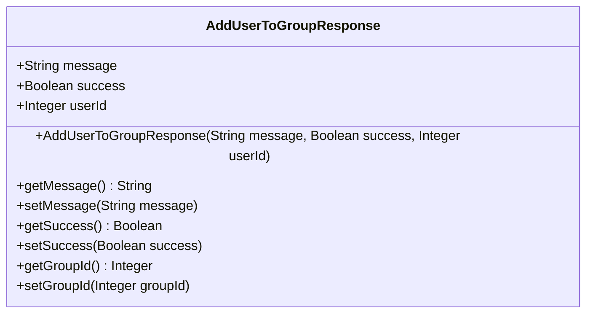
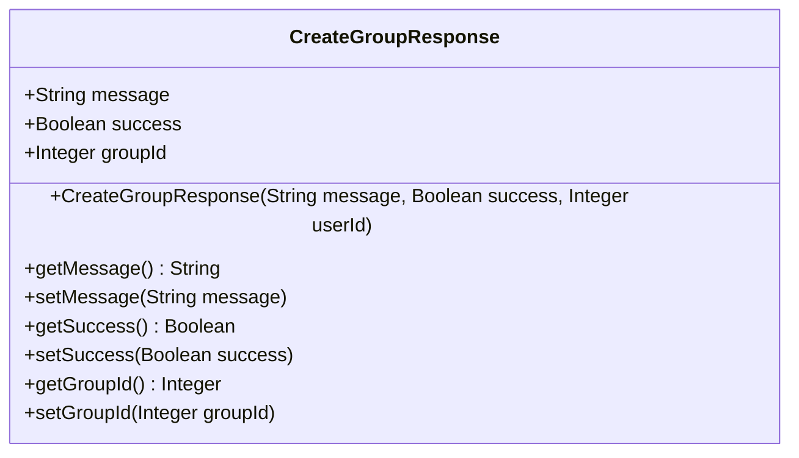
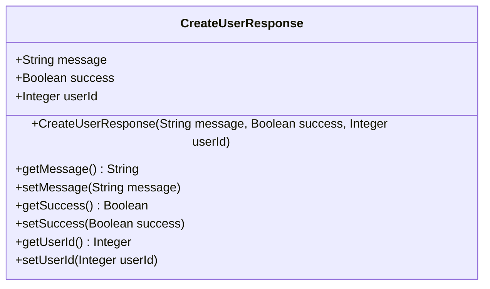
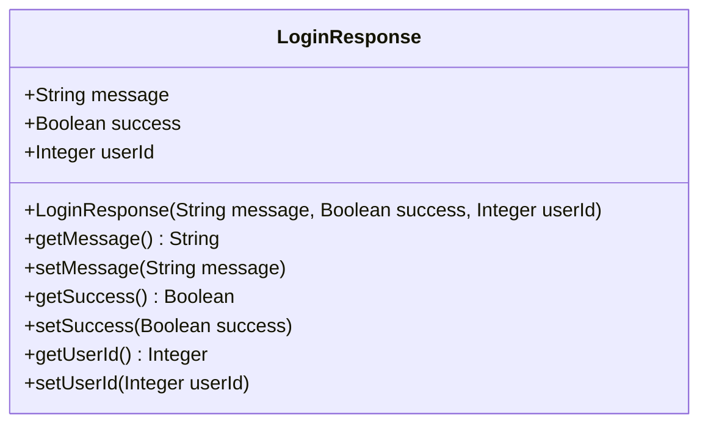
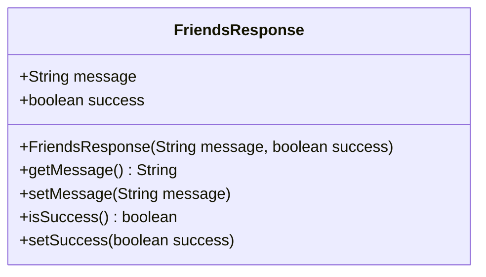
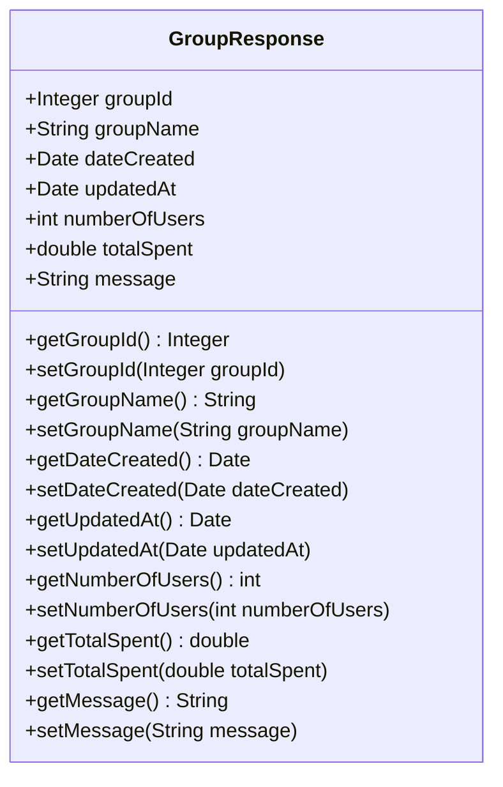

### AddUserToGroupResponse:

```mermaid
classDiagram
class AddUserToGroupResponse {
    +String message
    +Boolean success
    +Integer userId
    +AddUserToGroupResponse(String message, Boolean success, Integer userId)
    +getMessage() String
    +setMessage(String message)
    +getSuccess() Boolean
    +setSuccess(Boolean success)
    +getGroupId() Integer
    +setGroupId(Integer groupId)
}
```

### CreateGroupResponse:

```mermaid
classDiagram
class CreateGroupResponse {
    +String message
    +Boolean success
    +Integer groupId
    +CreateGroupResponse(String message, Boolean success, Integer userId)
    +getMessage() String
    +setMessage(String message)
    +getSuccess() Boolean
    +setSuccess(Boolean success)
    +getGroupId() Integer
    +setGroupId(Integer groupId)
}
```

### CreateUserResponse:

```mermaid
classDiagram
class CreateUserResponse {
    +String message
    +Boolean success
    +Integer userId
    +CreateUserResponse(String message, Boolean success, Integer userId)
    +getMessage() String
    +setMessage(String message)
    +getSuccess() Boolean
    +setSuccess(Boolean success)
    +getUserId() Integer
    +setUserId(Integer userId)
}
```

### LoginResponse: 

```mermaid
classDiagram
class LoginResponse {
    +String message
    +Boolean success
    +Integer userId
    +LoginResponse(String message, Boolean success, Integer userId)
    +getMessage() String
    +setMessage(String message)
    +getSuccess() Boolean
    +setSuccess(Boolean success)
    +getUserId() Integer
    +setUserId(Integer userId)
}
```

### FriendsResponse:

```mermaid
classDiagram
class FriendsResponse {
    +String message
    +boolean success
    +FriendsResponse(String message, boolean success)
    +getMessage() String
    +setMessage(String message)
    +isSuccess() boolean
    +setSuccess(boolean success)
}
```

### GroupResponse:

```mermaid
classDiagram
class GroupResponse {
    +Integer groupId
    +String groupName
    +Date dateCreated
    +Date updatedAt
    +int numberOfUsers
    +double totalSpent
    +String message
    +getGroupId() Integer
    +setGroupId(Integer groupId)
    +getGroupName() String
    +setGroupName(String groupName)
    +getDateCreated() Date
    +setDateCreated(Date dateCreated)
    +getUpdatedAt() Date
    +setUpdatedAt(Date updatedAt)
    +getNumberOfUsers() int
    +setNumberOfUsers(int numberOfUsers)
    +getTotalSpent() double
    +setTotalSpent(double totalSpent)
    +getMessage() String
    +setMessage(String message)
}
```

