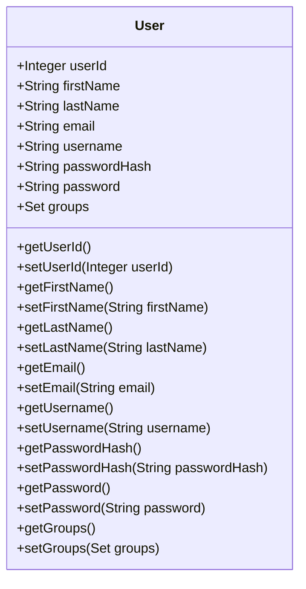
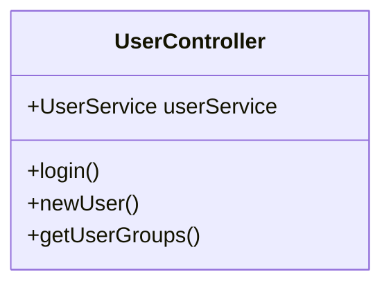
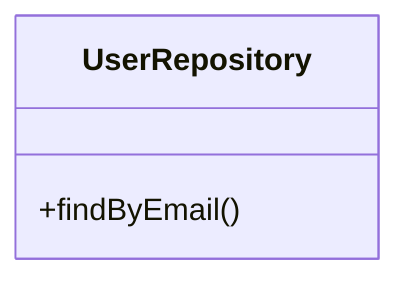
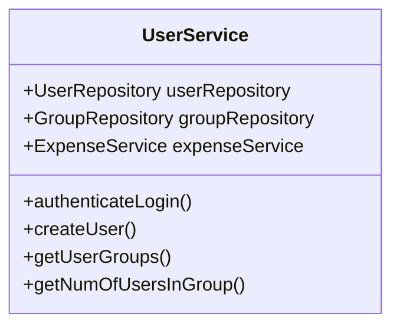

### UserEntity:

```mermaid
classDiagram
User: +Integer userId
User: +String firstName
User: +String lastName
User: +String email
User: +String username
User: +String passwordHash
User: +String password
User: +Set<Group> groups
User: +getUserId()
User: +setUserId(Integer userId)
User: +getFirstName()
User: +setFirstName(String firstName)
User: +getLastName()
User: +setLastName(String lastName)
User: +getEmail()
User: +setEmail(String email)
User: +getUsername()
User: +setUsername(String username)
User: +getPasswordHash()
User: +setPasswordHash(String passwordHash)
User: +getPassword()
User: +setPassword(String password)
User: +getGroups()
User: +setGroups(Set<Group> groups)
```

### UserController:

```mermaid
classDiagram
UserController: +UserService userService
UserController: +login()
UserController: +newUser()
UserController: +getUserGroups()
```

### UserRepository:

```mermaid
classDiagram
UserRepository: +findByEmail()
```

### UserService:

```mermaid
classDiagram
UserService: +UserRepository userRepository
UserService: +GroupRepository groupRepository
UserService: +ExpenseService expenseService
UserService: +authenticateLogin()
UserService: +createUser()
UserService: +getUserGroups()
UserService: +getNumOfUsersInGroup()
```

