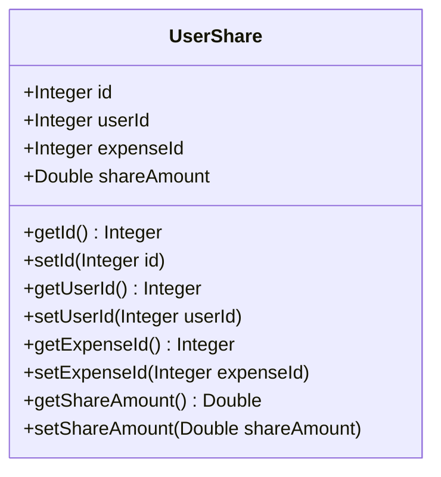
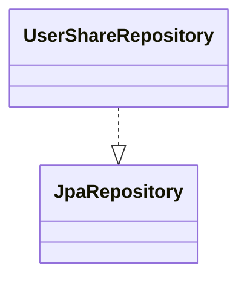

### UserShareEntity:

```mermaid
classDiagram
class UserShare {
    +Integer id
    +Integer userId
    +Integer expenseId
    +Double shareAmount
    +getId() Integer
    +setId(Integer id)
    +getUserId() Integer
    +setUserId(Integer userId)
    +getExpenseId() Integer
    +setExpenseId(Integer expenseId)
    +getShareAmount() Double
    +setShareAmount(Double shareAmount)
}
```

### UserShareReposiotry

```mermaid
classDiagram
class UserShareRepository {
}
UserShareRepository ..|> JpaRepository
```

